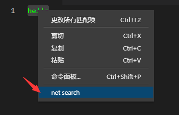

# net search



vscode settings.json

```json
  {
  "netSearch.urls": [
      {
        "label": "MDN",
        "url": "https://developer.mozilla.org/zh-CN/search?q=${q}"
      },
      {
        "label": "uniapp",
        "url": "https://www.google.com/search?q=uniapp ${q}"
      }
    ],
  }
  ```


  ## publish

  ```sh
  $ npm run vscode:prepublish
  $ vsce publish
  ```
