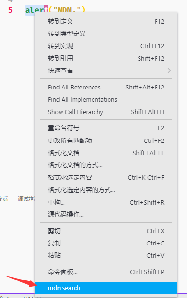

# mdn-search



1. 选择文本
2. 鼠标右键
3. 在左键点击"mdn search"

上图将使用浏览器打开"https://developer.mozilla.org/en-US/search?q=alert"

如果您想打开"https://developer.mozilla.org/zh-CN/search?q=alert"，那么你需要在"settings.json"中添加
  ```json
  {
    "mdnSearch.url": "https://developer.mozilla.org/zh-CN/search?q=${q}"
  }
  ```


  ## prepublish

  ```sh
  $ npm run vscode:prepublish
  $ vsce publish
  ```
